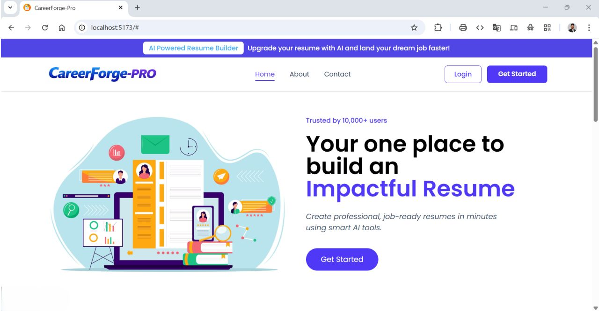
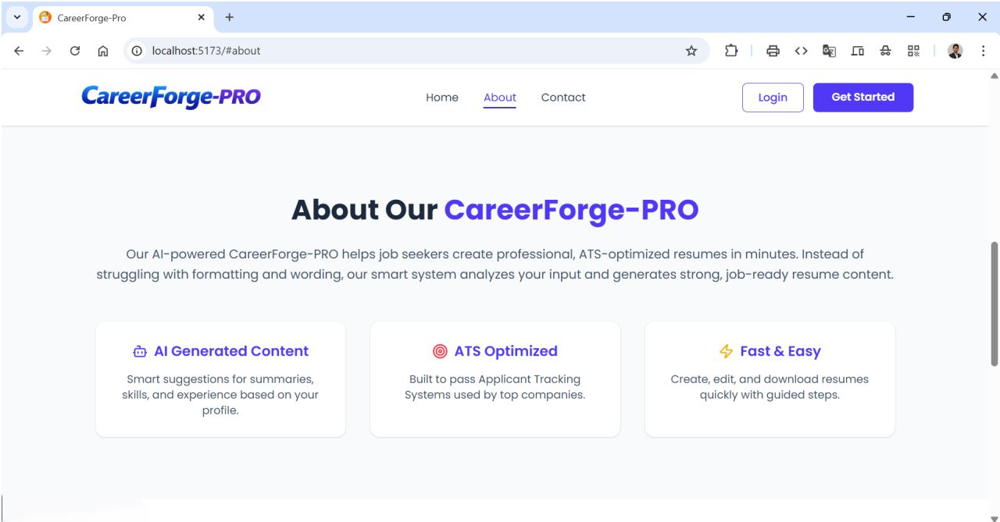
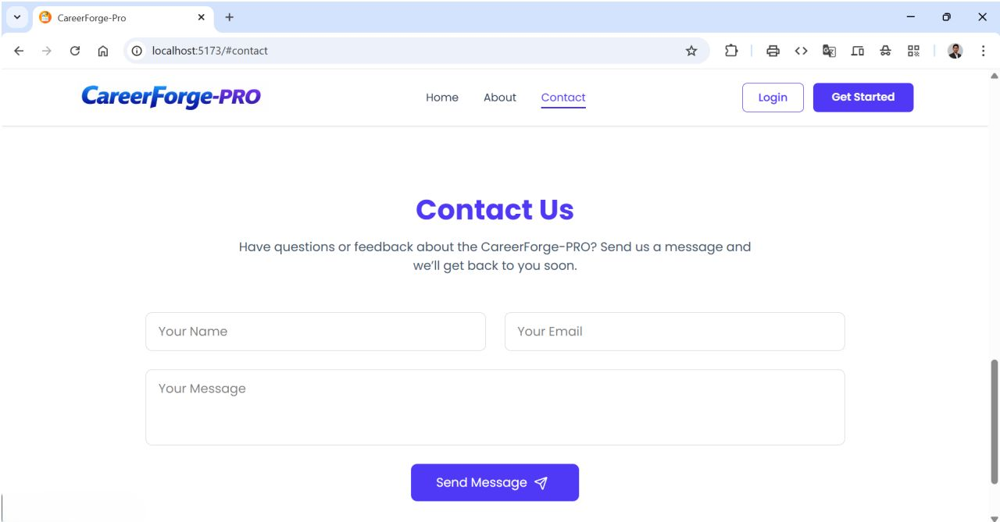
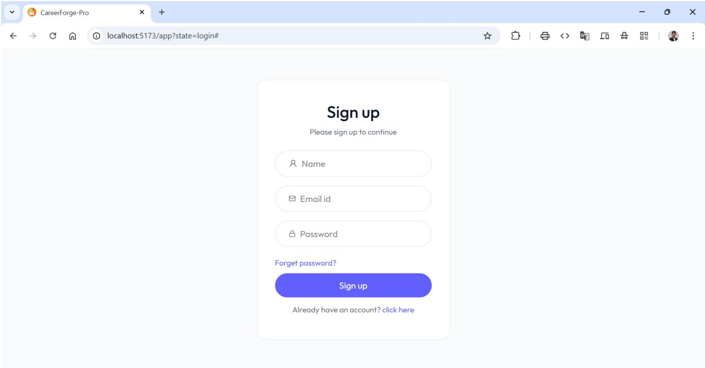
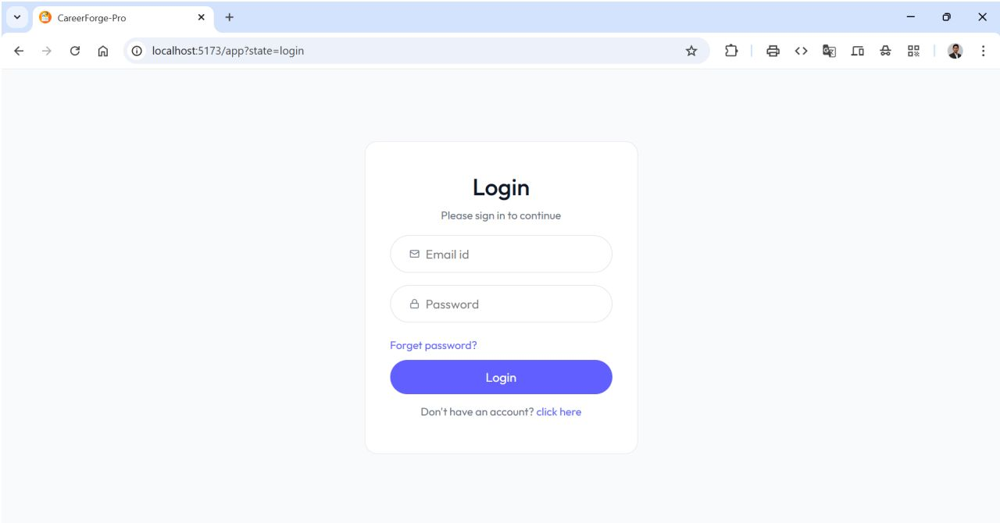
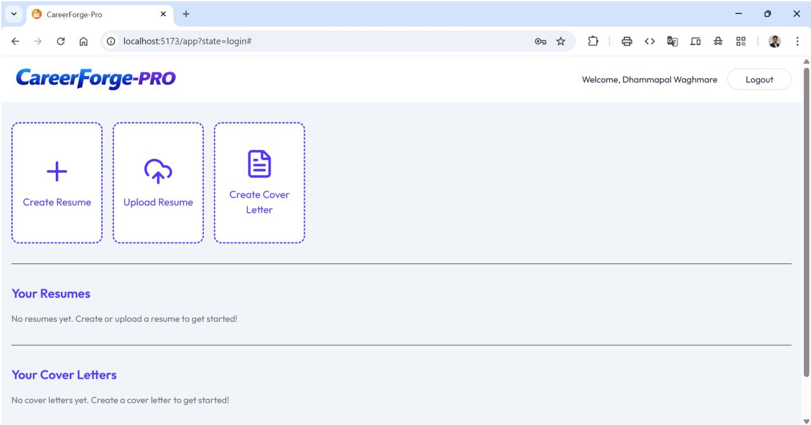
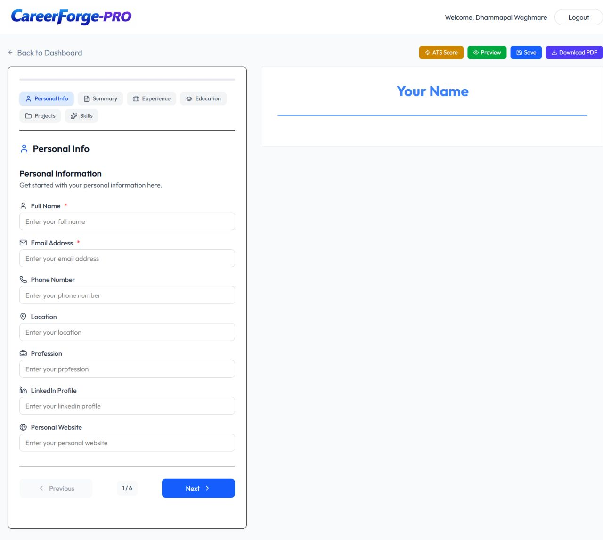
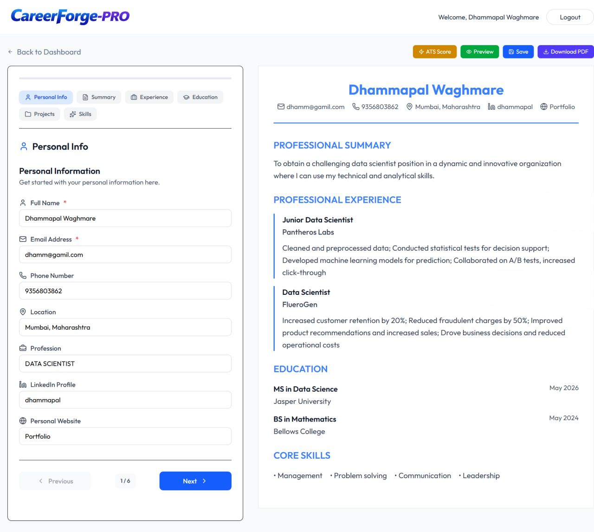
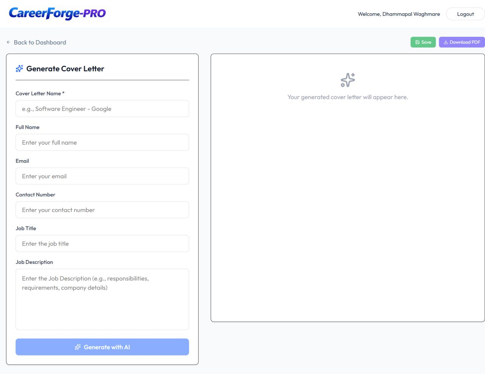

<h1>CareerForge Pro</h1>
<h3>About</h3>
<b>ATS-Proof Resume Generator </b>  
CareerForge Pro helps job seekers improve their chances of getting shortlisted by Applicant Tracking Systems (ATS). 
The platform analyzes job descriptions, extracts relevant keywords, and rewrites resume content using AI to boost 
ATS scores and generate professional PDF resumes.

<h3>Features</h3>
<ul>
  <li>AI-Powered Resume Optimization</li>
  <li>AI Cover Letter Generator</li>
  <li>ATS Score Analysis</li>
  <li>Professional PDF Generationt</li>
  <li>Job Description Analysis Engine</li>
</ul>

<h3>Tech Stack</h3>
<b>Frontend</b>   : React.js, Tailwind CSS  
<b>Backend</b>    : Node.js, Express.js  
<b>Database</b>   : MongoDB Atlas  
<b>AI & Tools</b> : Google Gemini (gemini-3-flash-preview)

<h3>How it Works</h3>
<ol>
  <li>Sign Up or Log In to CareerForge-Pro</li>
  <li>Creates a new resume from scratch or uploads an existing resume</li>
  <li>Pastes target job description</li>
  <li>AI analyzes and extracts keywords</li>
  <li>Resume are rewritten for better matching</li>
  <li>ATS score is calculated</li>
  <li>Optimized documents are exported as professional PDFs</li>
</ol>

<h3>Project Structure</h3>
<pre>
CareerForge-Pro/
├─ backend/                  # Node.js backend
│  ├─ configs/               # DB, AI, storage configs
│  ├─ controllers/           # Business logic
│  ├─ middlewares/           # Auth and request middlewares
│  ├─ models/                # MongoDB schemas
│  ├─ routes/                # API routes
│  ├─ package.json
│  └─ server.js
├─ frontend/                 # React frontend (Vite)
│  ├─ public/
│  ├─ src/
│  │  ├─ app/                # Redux store + slices
│  │  ├─ assets/             # Images/icons
│  │  ├─ components/         # UI components
│  │  ├─ configs/            # API config
│  │  ├─ pages/              # App pages
│  │  └─ styles/             # Global styles
│  ├─ index.html
│  ├─ package.json
│  └─ vite.config.js
└─ README.md
</pre>

<h3>Environment Variables</h3>
<pre>
  MONGODB_URI="your-mongodb-atlas-connection"
  OPENAI_API_KEY="your-api-key"  
  OPENAI_BASE_URL="your-base-url"
  OPENAI_MODEL="your-openai-model"  
  JWT_SECRET="your-secret-key"
</pre>

<h3>How to Run the Project</h3>
<pre>
  
  <b>1. Clone the Repository: </b>
  Link 🔗 https://github.com/dhammapal-waghmare/CareerForge-Pro
  <b>2. cd CareerForge-Pro</b>
  <b>3. cd backend</b>
  Step 1: Add Dependencies
  Step 2: npm run server
  <b>4. cd frontend</b>
  Step 1: Add Dependencies
  Step 2: npm run dev
  <b>5. Open the local URL (like http://localhost:5173/) in your browser.</b>
  <b>6. You have successfully run the project.</b>
  
</pre>

<h2>Demo</h2>

  
  
   
  
  
   
  
  
   
  
  
   
  

<h3>Team Members</h3>
<ol>
  <li>Dhammapal Jalindar Waghmare</li>
  <li>A.Anduni Induja</li>
  <li>Manikandan A</li>
  <li>Mayank Chourasiya</li>
</ol>

